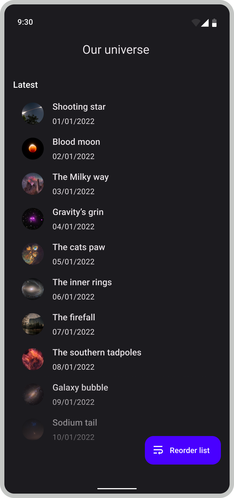
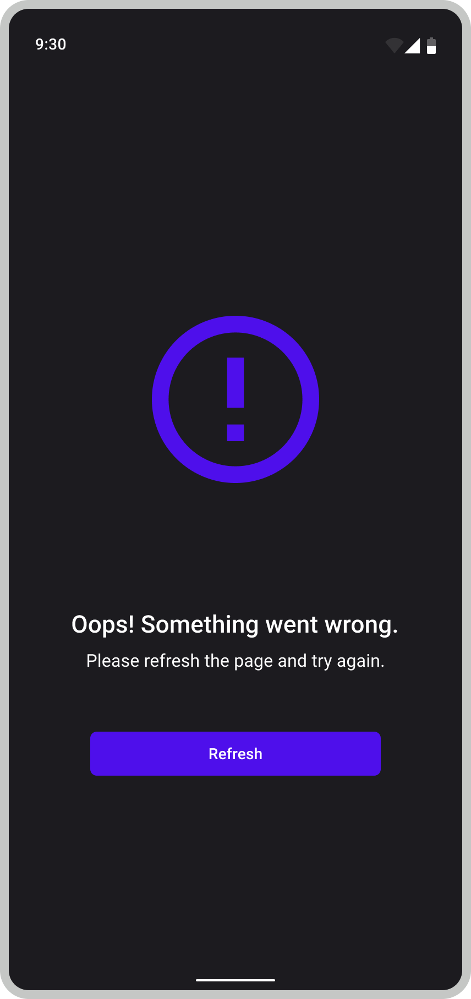

# Adyen Android Assignment

This repository contains the coding challenge for candidates applying for an Android role at Adyen.
Please keep your Git history intact as we are interested in your development process as well as the end result.
Feel free to make changes to any code in this repository.

Your task is to create an app using the NASA Astronomy Picture Of the Day (APOD) API.
We have set up some basic networking code; you still need to register for an [API key](https://api.nasa.gov/) 
and add it to `app/local.gradle` - see `local.gradle.example` for details. 
You can verify your API key works by running the `PlanetaryServiceTest`.

## Features:
- [ ] Create a list screen of APODs :
  * Sanitise list to ONLY show images - NOT videos.
- [ ] Implement ordering for APODs :
  * Order by title - ascending.
  * Order by date - descending.
- [ ] Show a details screen with more info about a single APOD .
- [ ] Implement error screens:
  * Api error .

n.b The resources folder has been updated with the appropriate colors and icons.
  
## Development Tasks:
Tips for candidates to think about.

- [ ] App to function in both portrait and landscape orientations:
   * Is the UI still functional - is state persisted?
   * Ensure unnecessary network calls are not made.
- [ ] Unit tests.

## Grading:
We are interested in:
* How the features work - user functionality.
* How they are implemented - architecture & styling.
* And why implementation decisions were taken.

**OPTIONAL**
* Allow user to save/persist APODs that they like and pin them to the top of the summary list screen.
* The UI/UX is not a strict requirement, feel free to make it pixel perfect with animations if you please.